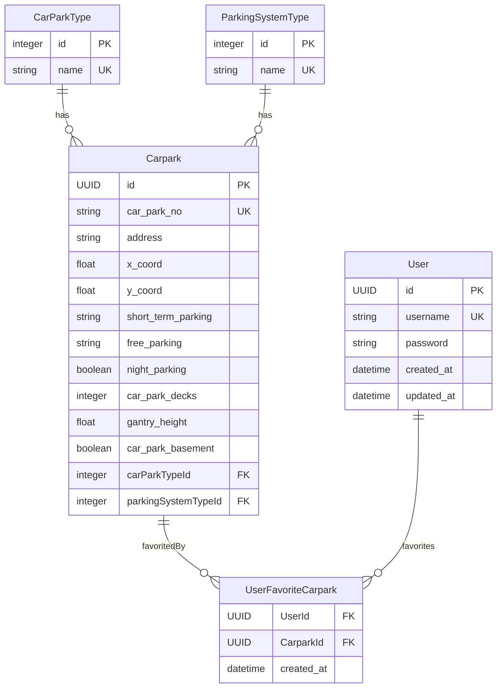

# Entity Relationship Diagram

## Database Schema

## Relationships

### One-to-Many Relationships
- A `CarParkType` can have many `Carpark`s
- A `ParkingSystemType` can have many `Carpark`s

### Many-to-Many Relationships
- `User` and `Carpark` have a many-to-many relationship through `UserFavoriteCarpark`
  - A user can favorite many carparks
  - A carpark can be favorited by many users

## Field Descriptions

### Carpark
- `id`: UUID primary key
- `car_park_no`: Unique identifier string
- `address`: Location address
- `x_coord`: X coordinate for location
- `y_coord`: Y coordinate for location
- `short_term_parking`: Short term parking availability
- `free_parking`: Free parking availability
- `night_parking`: Whether night parking is available
- `car_park_decks`: Number of parking decks
- `gantry_height`: Height of the gantry
- `car_park_basement`: Whether basement parking exists
- `carParkTypeId`: Foreign key to CarParkType
- `parkingSystemTypeId`: Foreign key to ParkingSystemType

### CarParkType
- `id`: Auto-incrementing primary key
- `name`: Unique type name

### ParkingSystemType
- `id`: Auto-incrementing primary key
- `name`: Unique system type name

### User
- `id`: UUID primary key
- `username`: Unique username
- `password`: Hashed password
- `created_at`: Account creation timestamp
- `updated_at`: Last update timestamp

### UserFavoriteCarpark
- `UserId`: UUID foreign key to User
- `CarparkId`: UUID foreign key to Carpark
- `created_at`: When the favorite was added

## Legend
- PK: Primary Key
- FK: Foreign Key
- UK: Unique Key
